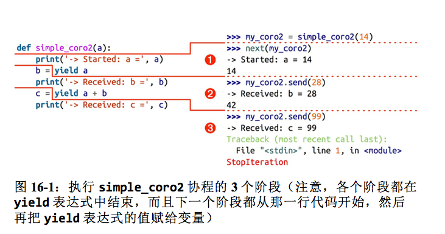

# Python 异步框架是如何工作的之协程篇 [视频]

上一篇博客中我们提到了使用 python selectors 模块和回调的方式来实现一个异步的 tcp echo server，代码大概如下。

```py
import selectors
import socket


class EventLoop:
    def __init__(self, selector=None):
        if selector is None:
            selector = selectors.DefaultSelector()
        self.selector = selector

    def run_forever(self):
        while True:  # EventLoop
            events = self.selector.select()
            for key, mask in events:
                if mask == selectors.EVENT_READ:
                    callback = key.data   # on_read or accept
                    callback(key.fileobj)
                else:
                    callback, msg = key.data
                    callback(key.fileobj, msg)  # callback is _on_write


class TCPEchoServer:
    def __init__(self, host, port, loop):
        self.host = host
        self.port = port
        self._loop = loop
        self.s = socket.socket()

    def run(self):
        self.s.setsockopt(socket.SOL_SOCKET, socket.SO_REUSEADDR, 1)
        self.s.bind((self.host, self.port))
        self.s.listen(128)
        self.s.setblocking(False)
        self._loop.selector.register(self.s, selectors.EVENT_READ, self._accept)
        self._loop.run_forever()

    def _accept(self, sock):
        conn, addr = sock.accept()
        print('accepted', conn, 'from', addr)
        conn.setblocking(False)
        self._loop.selector.register(conn, selectors.EVENT_READ, self._on_read)

    def _on_read(self, conn):
        msg = conn.recv(1024)
        if msg:
            print('echoing', repr(msg), 'to', conn)
            self._loop.selector.modify(conn, selectors.EVENT_WRITE, (self._on_write, msg))
        else:
            print('closing', conn)
            self._loop.selector.unregister(conn)
            conn.close()

    def _on_write(self, conn, msg):
        conn.sendall(msg)
        self._loop.selector.modify(conn, selectors.EVENT_READ, self._on_read)


event_loop = EventLoop()
echo_server = TCPEchoServer('localhost', 8888, event_loop)
echo_server.run()
```

回调的方式代码结构并不是很好看，回调多了还会形成恶心的回调地狱。这一次我们用协程来重构它，首先我们从生成器和协程讲起，
其实本想直接进入正题的，但是有些读者可能缺少这一块的概念，我这里还是迅速过一遍，我会列出很多链接供你参考。

# 从生成器(Generators)说起

python中生成器是用来生成值的函数。通常函数使用return返回值然后作用域被销毁，再次调用函数会重新执行。但是生成器可以yield一个值之后暂停函数执行，然后控制权交给调用者，之后我们可以恢复其执行并且获取下一个值，我们看一个例子：

```
def simple_gen():
    yield 'hello'
    yield 'world'

gen = simple_gen()
print(type(gen))    # 'generator' object
print(next(gen))    # 'hello'
print(next(gen))    # 'world'
print(next(gen))    # 协程结束抛出 StopIteration 异常
```

注意生成器函数调用的时候不会直接返回值，而是返回一个类似于可迭代对象(iterable)的生成器对象(generator object)，我们可以对生成器对象调用next()函数来迭代值，或者使用for循环。
生成器常用来节省内存，比如我们可以使用生成器函数yield值来替代返回一个耗费内存的大序列:

```py
def f(n):
    res = []
    for i in range(n):
        res.append(i)
    return res

def yield_n(n):
    for i in range(n):
        yield i

assert f(10) == list(yield_n(10))
```

## 什么是基于生成器的协程(coroutine)

上一节讲到了使用使用生成器来从函数中获取数据(pull data)，但是如果我们想发送一些数据呢（push
data）?这时候协程就发挥作用了。yield关键字既可以用来获取数据也可以在函数中作为表达式(在=右边的时候)。我们可以对生成器对象使用send()方法来给函数发送值。这叫做『基于生成器的协程』(generator
based coroutines)。

早期的python 生成器(generator) 可以挂起执行并且保存当前执行的状态，pep 342(Coroutines via Enhanced Generators)
又对其做了增强，生成器可以通过yield 暂停执行和向外返回数据，也可以通过send()向生成器内发送数据，还可以通过throw()向生成器内抛出异常以便随时终止生成器的运行。
（建议感兴趣的读者看看《Fluent Python》14 章和 16章来详细了解生成器、协程、yield from、async/await等概念)

我们先看一个简单的例子:

```py
def coro():
    hello = yield 'hello'    # yield关键字在=右边作为表达式，可以被send值
    yield hello


c = coro()
print(next(c))    # 输出 'hello'，这里调用 next 产出第一个值 'hello'，之后函数暂停
print(c.send('world'))    # 再次调用 send 发送值，此时 hello 变量赋值为 'world', 然后 yield 产出 hello 变量的值 'world'
# 之后协程结束，后续再 send 值会抛异常 StopIteration
```

这里发生了什么？

- 和之前一样我们先调用了next()函数，代码执行到yield 'hello'然后我们得到了’hello’。
- 之后我们使用了send函数发送了一个值’world’, 它使coro恢复执行并且赋了参数’world’给hello这个变量，接着执行到下一行的yield语句并将hello变量的值’world’返回。所以我们得到了send()方法的返回值’world’。

当我们使用基于生成器的协程(generator based coroutines)时候，术语”generator”和”coroutine”通常表示一个东西，尽管实际上不是。而python3.5以后增加了async/await关键字用来支持原生协程(native coroutines)，我们在后边讨论。


下边是另一个演示协程的例子，注意几个点（我建议你阅读 Fluent Python 相关章节来理解它），如果你对协程等概念不了解，下边的东西看着可能会比较吃力。

- 协程需要使用 send(None) 或者 next(coroutine) 来『预激』(prime) 才能启动
- 在 yield 处协程会暂停执行
- 单独的 yield value 会产出值给调用方
- 可以通过 coroutine.send(value) 来给协程发送值，发送的值会赋值给 yield 表达式左边的变量
- 协程执行完成后(没有遇到下一个 yield 语句)抛出 StopIteration 异常

请仔细看下边这个图示来理解协程的执行过程：



通常为了方便，我们会写一个装饰器来预激协程，这样就不用每次都先调用 send(None) 或者 next 了。

```py
from functools import wraps

def coroutine(func):
"""装饰器：向前执行到第一个`yield`表达式，预激`func`"""
    @wraps(func)
    def primer(*args,**kwargs):  ➊
        gen = func(*args,**kwargs)  ➋
        next(gen)  ➌
        return gen  ➍
    return primer
```

# yield from 的含义
python3 中引入了 yield from, 它的语义比较复杂，一开始理解会比较吃力，我建议你先阅读下 Fluent Python 16
章协程，它的主要作用有两个：

- 一个是链接子生成器
- 一个是作为委派生成器用来当调用者和子生成器的通道。

上边说的有点抽象，我们通过几个例子来看下 yield from 这两个作用的使用场景你就明白了。先看下边这个例子:

```
>>> def gen():
...     for c in 'AB':
...         yield c
...     for i in range(1, 3):
...         yield i
...
>>> list(gen())
['A', 'B', 1, 2]

>>> def gen():
...     yield from 'AB'
...     yield from range(1, 3)
...
>>> list(gen())
['A', 'B', 1, 2]
```

这个例子使用 yield from 简化了两个 for 循环 yield，使用一个 yield from 就能产出子生成器的内容，这样就减少了 for 循环的样板代码。
python3 引入了 yield from 语法用来链接可迭代对象，引用 pep 380 中的话就是

> “把迭代器当作生成器使用，相当于把子生成器的定义体内联在 yield from 表达式中。此外，子生成器可以执行 return 语句，返回一个值，而返回的值会成为 yield from 表达式的值。”

这样，使用 yield from 就可以起到了『委派』作用，这里我写一个小例子来演示委派生成器的用法，理解它对于后边理解使用协程异步编程非常重要：


```py
def coro1():
    """定义一个简单的基于生成器的协程作为子生成器"""
    word = yield 'hello'
    yield word
    return word    # 注意这里协程可以返回值了，返回的值会被塞到 StopIteration value 属性 作为 yield from 表达式的返回值


def coro2():
    """委派生成器，起到了调用方和子生成器通道的作用，请仔细理解下边的描述。
    委派生成器会在 yield from 表达式处暂停，调用方可以直接发数据发给子生成器，
    子生成器再把产出的值发给调用方。
    子生成器返回后， 解释器抛出 StopIteration异常， 并把返回值附加到异常对象上，此时委派生成器恢复
    """
    # 子生成器返回后，解释器抛出 StopIteration 异常，返回值被附加到异常对象上，此时委派生成器恢复
    result = yield from coro1()  # 这里 coro2 会暂停并把调用者的 send 发送给 coro1() 协程，coro1() 返回后其return 的值会被赋值给 result
    print('coro2 result', result)


def main():  # 调用方，用来演示调用方通过委派生成器可以直接发送值给子生成器值。这里main 是调用者，coro2 是委派生成器，coro1 是子生成器
    c2 = coro2()  # 委派生成器
    print(next(c2))   # 这里虽然调用的是 c2 的send，但是会发送给 coro1, 委派生成器进入 coro1 执行到第一个 yield 'hello' 产出 'hello'
    print(c2.send('world')) # 委派生成器发送给 coro1，word 赋值为 'world'，之后产出 'world'
    try:
        # 继续 send 由于 coro1 已经没有 yield 语句了，直接执行到了 return 并且抛出 StopIteration
        # 同时返回的结果作为 yield from 表达式的值赋值给左边的 result，接着 coro2() 里输出 "coro2 result world"
        c2.send(None)
    except StopIteration:
        pass

main()
```

执行这段代码的结果如下：

```py
hello
world
coro2 result world
```

yield from 的语义很复杂又有点让人混淆，不过可以先忽略异常处理，下边是一个简化版的伪代码表示 yield from 的含义(来自
Fluent Python 16章 协程)

```py
# RESULT = yield from EXPR 伪代码演示
_i = iter(EXPR)  # <1>
try:
    _y = next(_i)  # <2>
except StopIteration as _e:
    _r = _e.value  # <3>
else:
    while 1:  # <4>
        _s = yield _y  # <5>
        try:
            _y = _i.send(_s)  # <6>
        except StopIteration as _e:  # <7>
            _r = _e.value
            break

RESULT = _r  # <8>
```

请仔细阅读并理解下边的解释：

```
❶ EXPR 可以是任何可迭代的对象，因为获取迭代器 _i（这是子生成器）使用的是 iter() 函数。

❷ 预激子生成器；结果保存在 _y 中，作为产出的第一个值。

❸ 如果抛出 StopIteration 异常，获取异常对象的 value 属性，赋值给 _r——这是最简单情况下的返回值（RESULT）。

❹ 运行这个循环时，委派生成器会阻塞，只作为调用方和子生成器之间的通道。

❺ 产出子生成器当前产出的元素；等待调用方发送 _s 中保存的值。注意，这个代码清单中只有这一个 yield 表达式。

❻ 尝试让子生成器向前执行，转发调用方发送的 _s。

❼ 如果子生成器抛出 StopIteration 异常，获取 value 属性的值，赋值给 _r，然后退出循环，让委派生成器恢复运行。

❽ 返回的结果（RESULT）是 _r，即整个 yield from 表达式的值。

在这段简化的伪代码中，我保留了 PEP 380 中那段伪代码使用的变量名称。这些变量是：

_i（迭代器）

　　子生成器

_y（产出的值）

　　子生成器产出的值

_r（结果）

　　最终的结果（即子生成器运行结束后 yield from 表达式的值）

_s（发送的值）

　　调用方发给委派生成器的值，这个值会转发给子生成器

_e（异常）

　　异常对象（在这段简化的伪代码中始终是 StopIteration 实例）
```

如果到这里你的大脑还没有爆炸的话，我们开始步入正题，如何使用协程来改写之前的回调代码，当然涉及到异步的代码不可能完全避免回调，但是我们可以把回调封装起来，让应用层代码抛弃回调。
使用协程改写完之后，应用层代码大概如下形式：


```py
class TCPEchoServer:
    def __init__(self, host, port, loop):
        self.host = host
        self.port = port
        self._loop = loop
        self.s = socket.socket()

    def run(self):
        self.s.setsockopt(socket.SOL_SOCKET, socket.SO_REUSEADDR, 1)
        self.s.bind((self.host, self.port))
        self.s.listen(128)
        self.s.setblocking(False)

        while True:
            conn, addr = yield from self.accept()
            msg = yield from self.read(conn)
            if msg:
                yield from self.sendall(conn, msg)
            else:
                conn.close()
```


# 使用 Future 对象改写
如果不用回调的方式，如何获取到异步调用的结果呢？python 异步框架中使用到了一个叫做 Future
的对象，当异步调用执行完的时候，用来保存它的结果。 Future 对象的 result 用来保存未来的执行结果，set_result 用来设置 result并且运行给 future 对象添加的回调。
注意这里依然无法完全消除回调，但是却可以屏蔽掉业务层代码的回调，后边我们会看到。
为了让 Future 支持 yield from ，我们给他定义一个 `__iter__` 方法:

```py
class Future:
    def __init__(self):
        self.result = None   # 保存结果
        self._callbacks = []  # 保存对 Future 的回调函数

    def add_done_callback(self, fn):
        self._callbacks.append(fn)

    def set_result(self, result):
        self.result = result
        for callback in self._callbacks:
            callback(self)

    def __iter__(self):
        """ 让 Future 对象支持 yield from"""
        yield self  # 产出自己
        return self.result   # yield from 将把 result 值返回作为 yield from 表达式的值
```

好了，那如何使用 Future 呢，我们先来看个无聊的小例子，后边会演示如何使用 Future 对象和协程来消除在应用层代码消除回调：


```py
def callback1(a, b):
    c = a + b
    c = callback2(c)
    return c


def callback2(c):
    c *= 2
    callback3(c)
    return c


def callback3(c):
    print(c)


def caller(a, b):
    callback1(a, b)

caller(1, 2)  # 输出 6
```

这个例子中使用了多个嵌套回调， callback3 依赖 callback2 的结果，callback2 又依赖 callback1 的结果。
不需要电脑运行你在脑子里也可以想象出它的结果，虽然有点绕。如果使用 Future 改写呢？

```py
def callback_1(a, b):
    f = Future()

    def on_callback_1():
        f.set_result(a+b)

    on_callback_1()
    c = yield from f
    return c


def callback_2(c):
    f = Future()

    def on_callback_2():
        f.set_result(c*2)
    on_callback_2()
    c = yield from f
    return c


def callback_3(c):
    f = Future()

    def on_callback_3():
        f.set_result(c)
    on_callback_3()
    yield from f


def caller_use_yield_from(a, b):
    c1 = yield from callback_1(a, b)
    c2 = yield from callback_2(c1)
    yield from callback_3(c2)
    return c2
```

然后你再执行以下 caller_use_yield_from(1, 2)，你会发现没有任何输出，直接调用它并没什么卵用，因为这个时候有了 yield from
语句它成为了协程。 那我们怎么执行它呢？协程需要调用方来驱动执行，还记得我们之前说的 预激(prime) 吗？

```py
c = caller_use_yield_from(1,2)  # coroutine
f1 = c.send(None)   # 产出第一个 future 对象
f2 = c.send(f1.result)  # 驱动运行到第二个 callback
f3 = c.send(f2.result)
try:
    f4 = c.send(None)
except StopIteration as e:
    print(e.value)   # 输出结果 6
```

或者我们还可以用这种方式不断驱动它来执行，（后边我们会看到如何将它演变为 Task 类）:

```py
c = caller_use_yield_from(1, 2)  # coroutine
f = Future()
f.set_result(None)
next_future = c.send(f.result)
def step(future):
    next_future = c.send(future.result)
    next_future.add_done_callback(step)
while 1:
    try:
        step(f)
    except StopIteration as e:
        print(e.value)   # 输出结果 6
        break
```

呀，代码看起来似乎更麻烦和复杂了，似乎比用回调还晕，不过在 caller_use_yield_from 调用方这里，我们用协程和 Future 结合把回调给消除了。
当一个函数的结果依赖另一个函数的时候，我们不需要一个函数回调另一个函数，而是通过协程把上一个协程的结果
通过 send(value) 的方式发送给下一个依赖它的值的协程。(还记得之前讲到的协程可以用 send 发送值吗)。
真实的异步编程也是复杂的，只不过大量复杂性被框架掩盖了(比如写asyncio 库的人)，应用层代码会大大简化，比如这里的
TCPEchoServer.run 方法看起来比回调形式好看得多。

好了，有上面的铺垫，开始改造 TCPEchoServer 的几个方法，先从 accept 方法开始，注意代码的改动：

```py
    def accept(self):
        f = Future()

        def on_accept():
            conn, addr = self.s.accept()
            print('accepted', conn, 'from', addr)
            conn.setblocking(False)
            f.set_result((conn, addr))  # accept 的 result 是接受连接的新对象 conn, addr
        self._loop.selector.register(self.s, selectors.EVENT_READ, on_accept)
        conn, addr = yield from f  # 委派给 future 对象，直到 future 执行了 socket.accept() 并且把 result 返回
        self._loop.selector.unregister(self.s)
        return conn, addr
```

这里我们做了什么呢？同样还是使用 selectors 模块注册一个 server socket 的读事件的回调 on_accept()。
on_accept() 回调真正执行了的时候，我们把结果设置到 future.result 属性里，注意这里每个 accept() 都有自己的一个
Future对象。
之后如果遇到server socket 读事件代码会在运行到 yield from f 处暂停，然后执行权委派给了 future 对象，future
对象执行完成后把 socket.accept() 的结果 conn, addr 返回。这里的 accept() 可以看作是是委派生成器，future 是子生成器。

采用同样的方式我们可以改写 下 read 和 sendall 方法：

```py
    def read(self, conn):
        f = Future()

        def on_read():
            msg = conn.recv(1024)
            f.set_result(msg)
        self._loop.selector.register(conn, selectors.EVENT_READ, on_read)
        msg = yield from f
        return msg

    def sendall(self, conn, msg):
        f = Future()

        def on_write():
            conn.sendall(msg)
            f.set_result(None)
            self._loop.selector.unregister(conn)
            conn.close()
        self._loop.selector.modify(conn, selectors.EVENT_WRITE, on_write)
        yield from f
```

到这里我们整个 TCPEchoServer 就差不多了：

```py
class TCPEchoServer:
    def __init__(self, host, port, loop):
        self.host = host
        self.port = port
        self._loop = loop
        self.s = socket.socket()

    def run(self):   # 这是我们的应用层代码，看起来比起回调方便很多，但是内部 accept 等函数却做了很多工作
        self.s.setsockopt(socket.SOL_SOCKET, socket.SO_REUSEADDR, 1)
        self.s.bind((self.host, self.port))
        self.s.listen(128)
        self.s.setblocking(False)

        while True:
            conn, addr = yield from self.accept()
            msg = yield from self.read(conn)
            if msg:
                yield from self.sendall(conn, msg)
            else:
                conn.close()

    def accept(self):
        f = Future()

        def on_accept():
            conn, addr = self.s.accept()
            print('accepted', conn, 'from', addr)
            conn.setblocking(False)
            f.set_result((conn, addr))  # accept 的 result 是接受连接的新对象 conn, addr
        self._loop.selector.register(self.s, selectors.EVENT_READ, on_accept)
        conn, addr = yield from f  # 委派给 future 对象，直到 future 执行了 socket.accept() 并且把 result 返回
        self._loop.selector.unregister(self.s)
        return conn, addr

    def read(self, conn):
        f = Future()

        def on_read():
            msg = conn.recv(1024)
            f.set_result(msg)
        self._loop.selector.register(conn, selectors.EVENT_READ, on_read)
        msg = yield from f
        return msg

    def sendall(self, conn, msg):
        f = Future()

        def on_write():
            conn.sendall(msg)
            f.set_result(None)
            self._loop.selector.unregister(conn)
            conn.close()
        self._loop.selector.modify(conn, selectors.EVENT_WRITE, on_write)
        yield from f
```


## Task 驱动协程
上边使用 Future 将函数改造成了 生成器，之前说过生成器需要由 send(None) 或者 next 来启动， 之后可以通过 send(value) 的方式发送值并且继续执行。
前面我们使用如下方式来运行 caller_use_yield_from 协程:

```py
c = caller_use_yield_from(1, 2)  # coroutine
f = Future()
f.set_result(None)
next_future = c.send(f.result)
def step(future):
    next_future = c.send(future.result)
    next_future.add_done_callback(step)
while 1:
    try:
        step(f)
    except StopIteration as e:
        print(e.value)   # 输出结果 6
        break
```

这里我们重构下这种方式，写一个 Task 对象驱动协程执行。 注意我们的 TCPEchoServer.run 方法已经成了协程，我们用 Task 驱动它执行。
我们创建一个 Task 来管理生成器的执行。

```py
class Task:
    """管理生成器的执行"""

    def __init__(self, coro):
        self.coro = coro

    def step(self, future):
        next_future = self.coro.send(future.result)
        next_future.add_done_callback(self.step)

    def run(self):
        f = Future()
        f.set_result(None)
        while 1:
            try:
                self.step(f)
            except StopIteration as e:
                print(e.value)
                return
```

然后我们可以用如下方式使用它：

```py
Task(caller_use_yield_from(1,2)).run()
```

不过对于 TCPEchoServer 我们需要事件循环来驱动它，我们把 Task 修改成如下形式：

```py
class Task:
    """管理生成器的执行"""
    def __init__(self, coro):
        self.coro = coro
        f = Future()
        f.set_result(None)
        self.step(f)

    def step(self, future):
        try:  # 把当前 future 的结果发送给协程作为 yield from 表达式的值，同时执行到下一个 future 处
            next_future = self.coro.send(future.result)
        except StopIteration:
            return
        next_future.add_done_callback(self.step)
```

然后是我们的 EventLoop 事件循环类：

```py
class EventLoop:
    def __init__(self, selector=None):
        if selector is None:
            selector = selectors.DefaultSelector()
        self.selector = selector

    def create_task(self, coro):
        return Task(coro)

    def run_forever(self):
        while 1:
            events = self.selector.select()
            for event_key, event_mask in events:
                callback = event_key.data
                callback()
```

好了，最后我们来启动 TCPEchoServer:

```py
event_loop = EventLoop()
echo_server = TCPEchoServer('localhost', 8888, event_loop)
task = Task(echo_server.run())
event_loop.run_forever()
```

到这里基本就大功告成了，所有代码如下：

```py
import selectors
import socket


class Future:
    def __init__(self):
        self.result = None
        self._callbacks = []

    def add_done_callback(self, fn):
        self._callbacks.append(fn)

    def set_result(self, result):
        self.result = result
        for callback in self._callbacks:
            callback(self)

    def __iter__(self):
        yield self
        return self.result


class Task:
    """管理生成器的执行"""
    def __init__(self, coro):
        self.coro = coro
        f = Future()
        f.set_result(None)
        self.step(f)

    def step(self, future):
        try:  # 把当前 future 的结果发送给协程作为 yield from 表达式的值，同时执行到下一个 future 处
            next_future = self.coro.send(future.result)
        except StopIteration:
            return
        next_future.add_done_callback(self.step)


class TCPEchoServer:
    def __init__(self, host, port, loop):
        self.host = host
        self.port = port
        self._loop = loop
        self.s = socket.socket()

    def run(self):
        self.s.setsockopt(socket.SOL_SOCKET, socket.SO_REUSEADDR, 1)
        self.s.bind((self.host, self.port))
        self.s.listen(128)
        self.s.setblocking(False)

        while True:
            conn, addr = yield from self.accept()
            msg = yield from self.read(conn)
            if msg:
                yield from self.sendall(conn, msg)
            else:
                conn.close()

    def accept(self):
        f = Future()

        def on_accept():
            conn, addr = self.s.accept()
            print('accepted', conn, 'from', addr)
            conn.setblocking(False)
            f.set_result((conn, addr))  # accept 的 result 是接受连接的新对象 conn, addr
        self._loop.selector.register(self.s, selectors.EVENT_READ, on_accept)
        conn, addr = yield from f  # 委派给 future 对象，直到 future 执行了 socket.accept() 并且把 result 返回
        self._loop.selector.unregister(self.s)
        return conn, addr

    def read(self, conn):
        f = Future()

        def on_read():
            msg = conn.recv(1024)
            f.set_result(msg)
        self._loop.selector.register(conn, selectors.EVENT_READ, on_read)
        msg = yield from f
        return msg

    def sendall(self, conn, msg):
        f = Future()

        def on_write():
            conn.sendall(msg)
            f.set_result(None)
            self._loop.selector.unregister(conn)
            conn.close()
        self._loop.selector.modify(conn, selectors.EVENT_WRITE, on_write)
        yield from f


class EventLoop:
    def __init__(self, selector=None):
        if selector is None:
            selector = selectors.DefaultSelector()
        self.selector = selector

    def create_task(self, coro):
        return Task(coro)

    def run_forever(self):
        while 1:
            events = self.selector.select()
            for event_key, event_mask in events:
                callback = event_key.data
                callback()


event_loop = EventLoop()
echo_server = TCPEchoServer('localhost', 8888, event_loop)
task = Task(echo_server.run())
event_loop.run_forever()
```

# 原生协程, async/await

到目前为止，我们仍然使用的是 基于生成器的协程(generators based
coroutines)，在python3.5中，python增加了使用async/await语法的原生协程(native coroutines)，
它们使用起来并没有功能上的差别。
我们把之前的所有 yield from 改成 await，同时函数定义前面加上 async 就好了。
不过注意 Future 需要定义 `__await__` 方法 :

```py
class Future:
    def __init__(self):
        self.result = None
        self._callbacks = []

    def add_done_callback(self, fn):
        self._callbacks.append(fn)

    def set_result(self, result):
        self.result = result
        for callback in self._callbacks:
            callback(self)

    def __iter__(self):
        yield self
        return self.result

    __await__ = __iter__ # make compatible with 'await' expression

class Task:
    def __init__(self, coro):
        self.coro = coro
        f = Future()
        f.set_result(None)
        self.step(f)

    def step(self, future):
        try:
            next_future = self.coro.send(future.result)
        except StopIteration:
            return
        next_future.add_done_callback(self.step)


class TCPEchoServer:
    def __init__(self, host, port, loop):
        self.host = host
        self.port = port
        self._loop = loop
        self.s = socket.socket()

    async def run(self):
        self.s.setsockopt(socket.SOL_SOCKET, socket.SO_REUSEADDR, 1)
        self.s.bind((self.host, self.port))
        self.s.listen(128)
        self.s.setblocking(False)

        while True:
            conn, addr = await self.accept()
            msg = await self.read(conn)
            if msg:
                await self.sendall(conn, msg)
            else:
                conn.close()

    async def accept(self):
        f = Future()

        def on_accept():
            conn, addr = self.s.accept()
            print('accepted', conn, 'from', addr)
            conn.setblocking(False)
            f.set_result((conn, addr))
        self._loop.selector.register(self.s, selectors.EVENT_READ, on_accept)
        conn, addr = await f
        self._loop.selector.unregister(self.s)
        return conn, addr

    async def read(self, conn):
        f = Future()

        def on_read():
            msg = conn.recv(1024)
            f.set_result(msg)
        self._loop.selector.register(conn, selectors.EVENT_READ, on_read)
        msg = await f
        return msg

    async def sendall(self, conn, msg):
        f = Future()

        def on_write():
            conn.sendall(msg)
            f.set_result(None)
            self._loop.selector.unregister(conn)
            conn.close()
        self._loop.selector.modify(conn, selectors.EVENT_WRITE, on_write)
        await f


class EventLoop:
    def __init__(self, selector=None):
        if selector is None:
            selector = selectors.DefaultSelector()
        self.selector = selector

    def create_task(self, coro):
        return Task(coro)

    def run_forever(self):
        while 1:
            events = self.selector.select()
            for event_key, event_mask in events:
                callback = event_key.data
                callback()


event_loop = EventLoop()
echo_server = TCPEchoServer('localhost', 8888, event_loop)
task = Task(echo_server.run())
event_loop.run_forever()
```

这样就使用 async/await 改写了之前的例子。

## 参考资料

这里一些参考过的比较好的资料，如果你觉得的理解起来有问题，可以参考这些链接或者书籍：

《Fluent Python》

[深入理解 Python 异步编程](https://mp.weixin.qq.com/s/GgamzHPyZuSg45LoJKsofA)

[从 asyncio 简单实现看异步是如何工作的](https://www.4async.com/2016/02/simple-implement-asyncio-to-understand-how-async-works/)

[Python generators, coroutines, native coroutines and async/await]()
