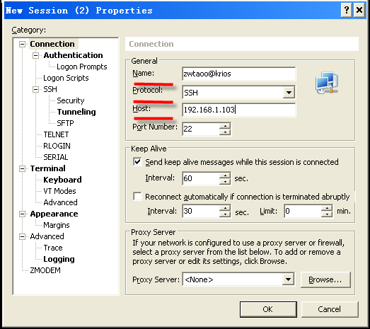
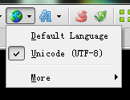
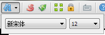
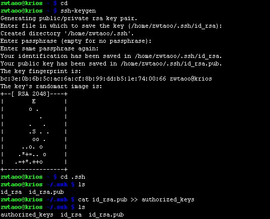
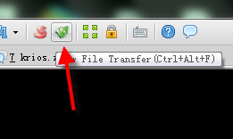
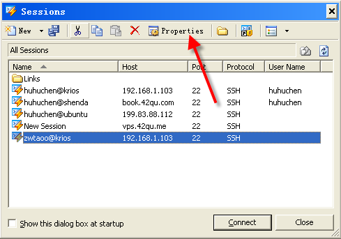
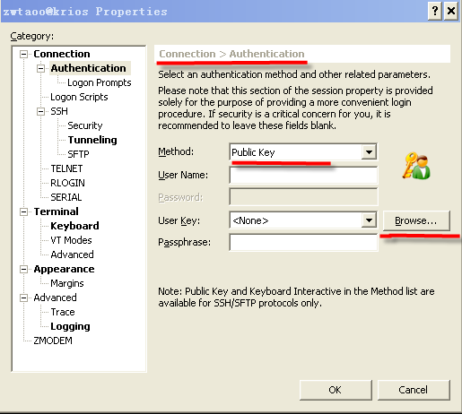
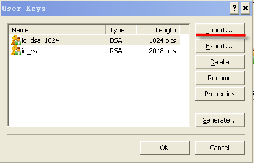
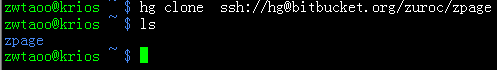

.. _xshell: 

xshell 客户端
===========================================

.. _ssh_login:

Xshell : 极好用的免费SSH客户端 
-------------------------------------------

`点此下载 Xshell <http://dl.pconline.com.cn/download/59166.html>`_
`点此下载 Xftp <http://dl.pconline.com.cn/download/61110.html>`_

创建session
-------------------------------------------

安装好xshell后，打开软件，点击菜单栏“File”中的“new”,将出现下图所示弹窗，填写相应信息。其中Host为邮件中所给的主机ip地址（name栏可以不用修改，但一般为便于在xshell中区分不同的主机，自己一般会修改为“用户名@主机”，也可以用“用户名@42qu”），然后点击“ok”。

登录
------------------------------------------

在随后弹出的弹窗中选择自己创建的帐号，点击“connect”，在弹出窗口中输入邮件中提供的用户名，新窗口中选择“keyboard Interactive”

并确定，最后输入邮件中提供的密码，即可登录到自己的vps中。

#. .. image::  _image/login1.png

#. .. image::  _image/login2.png

#. .. image::  _image/login3.png

设置显示编码
-------------------------------------------

简单设置一下xshell的字符显示，在下图所示的导航按钮中，勾选“UTF-8”。

顺便可以设置下字体

如果觉得粗体看着碍眼, 那么可以修正下显示设置

#. .. image::  _image/xshell_font_btn.png

#. .. image::  _image/xshell_font.png

配置密钥登录 , 无需每次输入密码
---------------------------------------

为避免每次登录vps都需要重复输入用户名和密码的步骤，可以通过生成.ssh/authorized_keys来减少麻烦。

执行::

    cd ~ 

命令，来到home(家)目录

执行::
    
    ssh-keygen

命令 , 然后按两次回车, 生成密钥

执行::
    
    cd  .ssh

进入.ssh目录

执行::
    
    cat id_rsa.pub >> authorized_keys

将把当前目录下

id_rsa.pub中的数据拷贝一份到新建的authorized_keys档案中。

点击导航中的“new file transfer”图标，如下图所示。

弹出窗口中忽视警告，确定后输入密码，在.ssh目录下执行“get id_rsa”命令，id_rsa将被保存到下图红线所示的本地目录中。

.. image:: _image/getkeys.png

在xshell菜单栏中依次点击“File”->“open”，选中你的session用户，并点击“Properties”，如下图所示。

做下图所示修改，点击“Browse”按钮。

点击import按钮，选择id_rsa，之后一路确定，再次登录是就可以不用再输入用户名和密码了。

克隆代码
--------------------------------------------------

重新登录后，为了方便学习各种命令; 我们可以首先克隆一份 42qu.com 的源代码, 执行::

    hg clone https://bitbucket.org/zuroc/zpage 

等上十分钟 , 会在当前目录下生成新目录zpage，其中包括了项目的所有代码，如图所示。

   
安装 virtualenv
--------------------------------------------------

首先运行 ::

    virtualenv .

然后修改 ~/.bash_profile 如下 ::

    [[ -f ~/.bashrc ]] && . ~/.bashrc
    export PATH=$HOME/bin:$HOME/sbin:$PATH:/usr/sbin:/sbin

再运行 ::

    source ~/.bash_profile 

再运行 ::

    pip install setuptools --upgrad

然后就可以使用 pip 或者 easy_install 安装python的库了
